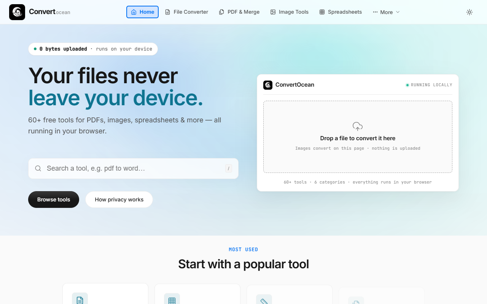
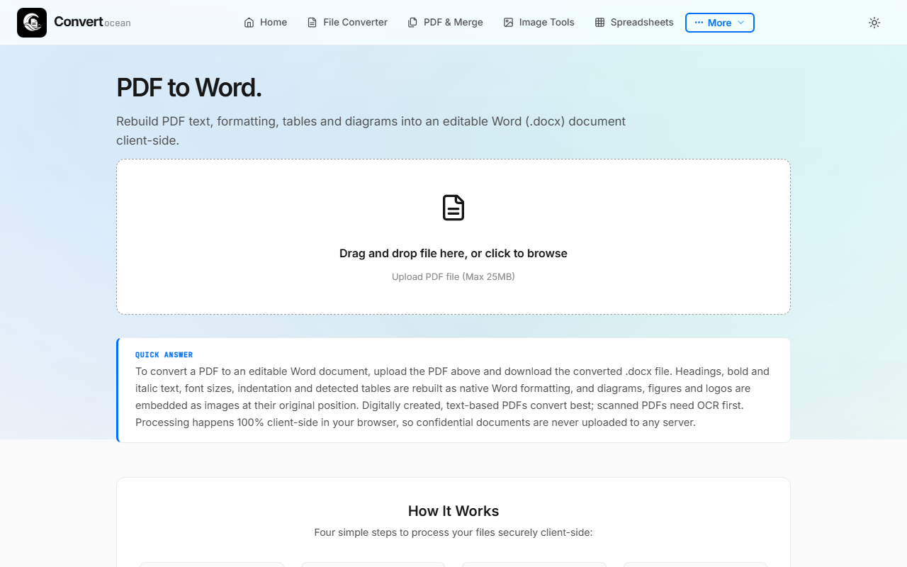
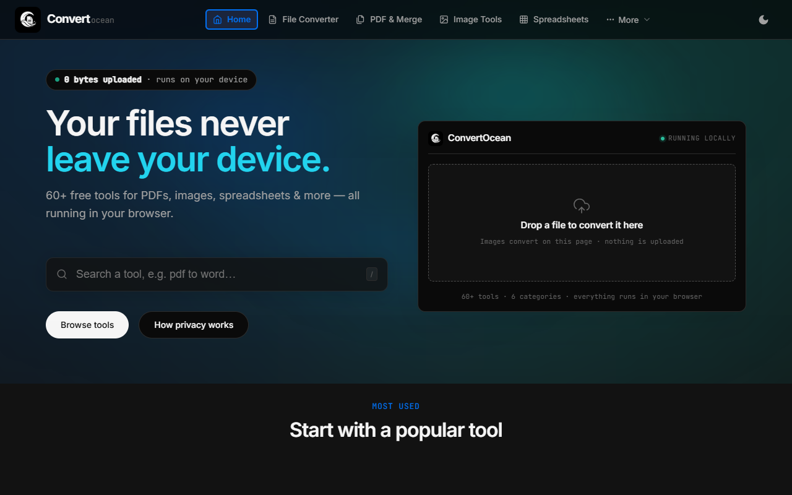
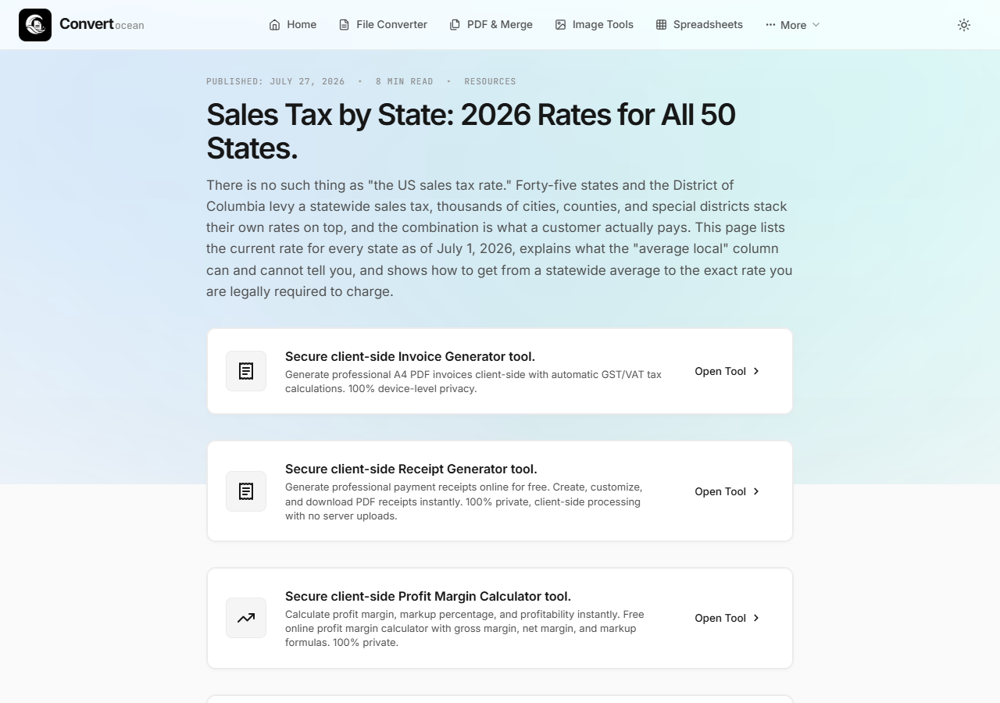

<div align="center">

# ConvertOcean

**60+ free file tools that run entirely in your browser — your files never leave your device.**

[**Try it live →**](https://convertocean.com) · [Guides](https://convertocean.com/guides/) · [How privacy works](https://convertocean.com/privacy-first/)

[](LICENSE)
[](https://astro.build)
[](https://convertocean.com/privacy-first/)
[](#what-it-is)



</div>

---

## What it is

ConvertOcean is a privacy-first toolkit for everyday file work: converting PDFs, images, spreadsheets and data formats, merging and splitting documents, resizing images to exact dimensions or file sizes, extracting text with OCR, and a set of business calculators.

The difference from most online converters is architectural. Traditional tools upload your file to a server, process it there, and send it back. **ConvertOcean does the conversion inside your browser** using WebAssembly and JavaScript — nothing is transmitted, nothing is stored remotely, and there is no upload queue to wait on.

That means:

- **Nothing is uploaded.** Your contracts, ID scans, financial spreadsheets and photos stay on your machine.
- **It keeps working offline.** Once a tool page has loaded, conversions continue with the network disconnected.
- **No accounts, no limits.** No sign-up, no daily caps, no file-size tiers — the practical limit is your device's memory.
- **It's fast.** No upload/download round trip, so most conversions finish in about a second.

Because the site is fully client-side, you don't have to take the privacy claim on trust — this repository is the code that runs, and your browser's DevTools will confirm no file ever crosses the network.

### Verify the privacy claim in 30 seconds

Don't take our word for it. On any tool page:

1. Open DevTools → **Network** tab, and tick **Preserve log**.
2. Convert a file.
3. Filter by `Fetch/XHR` and sort by size. **There is no request carrying your file** — the only traffic is the page's own assets, analytics, and ads.

Stronger still: load a tool page, switch your machine to airplane mode, and convert anyway. It works, because the conversion never needed the network. That is the difference between "we delete your files after an hour" and "your files were never sent."

<sub>Note on transparency: the site does load Google Analytics and AdSense, which set cookies — the no-upload promise is about your *files*, not a claim of zero third-party scripts. Details in the [privacy policy](https://convertocean.com/privacy/).</sub>

## What's inside

| Category | Examples |
|---|---|
| **PDF** | PDF ↔ Word, PDF → Excel, PDF → TXT, merge, split, image → PDF |
| **Images** | JPG ↔ PNG, WebP ↔ PNG/JPG, SVG → PNG/JPG/WebP, resize (exact px or target KB), merge, split |
| **Spreadsheets** | Excel ↔ CSV/JSON/PDF, XLS/XLSX handling, merge, split |
| **Developer data** | CSV ↔ JSON, XML → JSON/CSV/XLSX, JSON formatter & validator |
| **Documents** | Word → PDF/TXT, PowerPoint → PDF, TXT → PDF, merge, split |
| **OCR** | Image → text (Tesseract, on-device) |
| **Business** | Invoice & receipt generators, profit-margin, break-even, percentage and sales-tax calculators |

Plus a library of long-form guides covering the format decisions behind the tools.

## Screenshots

| A tool page | Dark mode |
|---|---|
|  |  |

Long-form reference content sits alongside the tools — for example, [sales tax rates for all 50 US states](https://convertocean.com/guides/us-sales-tax-by-state/):



## Tech stack

- **[Astro](https://astro.build)** — static site generation, zero client JS by default
- **Vanilla CSS** with a design-token system (light/dark theming)
- **Client-side engines** — [pdf-lib](https://pdf-lib.js.org/) and [pdf.js](https://mozilla.github.io/pdf.js/) for PDFs, [SheetJS](https://sheetjs.com/) for spreadsheets, [Tesseract.js](https://tesseract.projectnaptha.com/) for OCR, and native Canvas APIs for images
- **Cloudflare Pages** for hosting

No backend, no database, no user accounts — the entire site is static assets.

## Running locally

```bash
npm install
npm run dev          # dev server with hot reload
npm run build        # production build into dist/
npm run preview      # serve the production build locally
```

Requires Node 18+.

## Project structure

```
src/
  components/     Astro components (tools live in components/tools/)
  data/           Tool metadata, page content, guides, comparisons
  layouts/        Base layout, <head>, schema markup
  pages/          Routes — [tool].astro and [category].astro drive most pages
  styles/         theme.css — design tokens and global styles
public/           Static assets, favicons, robots.txt
```

Most tool pages are generated from `src/data/tools.ts` plus a matching component in `src/components/tools/`.

## Contributing

Issues and pull requests are welcome. Two things worth knowing before you open one:

1. **Client-side only.** Any feature that would require uploading user files to a server is out of scope by design — that constraint is the product.
2. **Honesty over feature count.** Tool descriptions should reflect what the code actually does. If a format or capability isn't genuinely supported, it doesn't get listed.

## License

[MIT](LICENSE) — free to use, modify and distribute.
